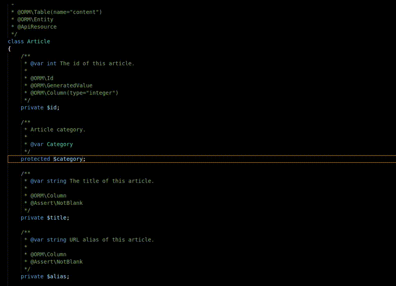

# PHP getters and setters for Visual Studio Code

> Fast generator of getters and setters for your PHP class properties.

## Features

This extension allows you to quickly generate getters and setters with one single command.

It adds 3 comands to vscode's command palette:

* Insert PHP getter.
* Insert PHP setter.
* Insert PHP getter and setter.

## Extension Settings

This extension contributes the following settings:

* `phpGetterSetter.short`: Shorten Getter and Setter to be one line each. Default: false

## Release Notes

Relevant releases:

### 1.0.0

* Initial release
